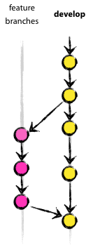

# стратегия работы в git


## Порядок работы


## Ветви

### Основные ветви

Присутствуют всегда, никогда не удаляются.

* ```master``` *(origin)*
* ```develop```


### Вспомогательные ветви

Три типа ветвей
* ветви функциональности *(feature)*
* ветви релизов *(release)*
* ветви исправлений *(hotfix)*


#### Ветви функциональности (feature)

Могут порождаться от: ```develop``` <br>
Должны вливаться в: ```develop``` <br>
Соглашение о наименовании: всё, за исключением ```master```, ```develop```, ```release-*``` или ```hotfix-*``` <br>



##### Создание ветви функциональности (feature branch)

При начале работы над новой функциональностью делается ответвление от ветви разработки (develop).

```git
$ git checkout -b myfeature develop
Switched to a new branch "myfeature"
```

##### Добавление завершённой функциональности в develop

Завершённая функциональность (фича) вливается обратно в ветвь разработки (develop) и попадает в следующий релиз.

```git
$ git checkout develop
Switched to branch 'develop'
$ git merge --no-ff myfeature
Updating ea1b82a..05e9557
(Отчёт об изменениях)
$ git branch -d myfeature
Deleted branch myfeature (was 05e9557).
$ git push origin develop
```

Флаг --no-ff вынуждает Git всегда создавать новый объект коммита при слиянии, даже если слияние может быть осуществлено алгоритмом fast-forward. Это позволяет не терять информацию о том, что ветка существовала, и группирует вместе все внесённые изменения.


#### Ветви релизов (release)

Могут порождаться от: ```develop``` <br>
Должны вливаться в: ```develop``` и ```master``` <br>
Соглашение о наименовании: ```release-*``` <br>


##### создание ветви релиза

Ветвь релиза создаётся из ветви разработки (develop).

```git
$ git checkout -b release-1.2 develop
Switched to a new branch "release-1.2"
$ ./bump-version.sh 1.2
Files modified successfully, version bumped to 1.2.
$ git commit -a -m "Bumped version number to 1.2"
[release-1.2 74d9424] Bumped version number to 1.2
1 files changed, 1 insertions(+), 1 deletions(-)
```

##### закрытие ветви релиза

Когда мы решаем, что ветвь релиза (release branch) окончательно готова для выпуска, нужно проделать несколько действий. В первую очередь ветвь релиза вливается в главную ветвь (напоминаю, каждый коммит в master — это по определению новый релиз). Далее, этот коммит в master должен быть помечен тегом, чтобы в дальнейшем можно было легко обратиться к любой существовавшей версии продукта. И наконец, изменения, сделанные в ветви релиза (release branch), должны быть добавлены обратно в разработку (ветвь develop), чтобы будущие релизы также содержали внесённые исправления багов.

```git
$ git checkout master
Switched to branch 'master'
$ git merge --no-ff release-1.2
Merge made by recursive.
(Отчёт об изменениях)
$ git tag -a 1.2
```

Теперь релиз издан и помечен тегом.

Чтобы сохранить изменения и в последующих релизах, мы должны влить эти изменения обратно в разработку. Делаем это так:

```git
$ git checkout develop
Switched to branch 'develop'
$ git merge --no-ff release-1.2
Merge made by recursive.
(Отчёт об изменениях)
```


Теперь мы окончательно разделались с веткой релиза. Можно её удалять, потому что она нам больше не понадобится:

```git
$ git branch -d release-1.2
Deleted branch release-1.2 (was ff452fe).
```

#### Ветви исправлений (hotfixes)


Могут порождаться от: ```master``` <br>
Должны вливаться в: ```develop``` и ```master``` <br>
Соглашение о наименовании: ```hotfix-*``` <br>


Смысл её существования состоит в том, что работа команды над ветвью разработки (develop) может спокойно продолжаться, в то время как кто-то один готовит быстрое исправление производственной версии.

##### Создание ветви исправлений (hotfix)

Ветви исправлений (hotfix branches) создаются из главной (master) ветви.

```git
$ git checkout -b hotfix-1.2.1 master
Switched to a new branch "hotfix-1.2.1"
$ ./bump-version.sh 1.2.1
Files modified successfully, version bumped to 1.2.1.
$ git commit -a -m "Bumped version number to 1.2.1"
[hotfix-1.2.1 41e61bb] Bumped version number to 1.2.1
1 files changed, 1 insertions(+), 1 deletions(-)
```

Не забывайте обновлять номер версии после создания ветви!

Теперь можно исправлять баг, а изменения издавать хоть одним коммитом, хоть несколькими.

```git
$ git commit -m "Fixed severe production problem"
[hotfix-1.2.1 abbe5d6] Fixed severe production problem
5 files changed, 32 insertions(+), 17 deletions(-)
```

##### Закрытие ветви исправлений (hotfix)

Когда баг исправлен, изменения надо влить обратно в главную ветвь (master), а также в ветвь разработки (develop), чтобы гарантировать, что это исправление окажется и в следующем релизе. Это очень похоже на то, как закрывается ветвь релиза (release branch).

Прежде всего надо обновить главную ветвь (master) и пометить новую версию тегом.

```git
$ git checkout master
Switched to branch 'master'
$ git merge --no-ff hotfix-1.2.1
Merge made by recursive.
(Отчёт об изменениях)
$ git tag -a 1.2.1
```

Следующим шагом переносим исправление в ветвь разработки (develop).

```git
$ git checkout develop
Switched to branch 'develop'
$ git merge --no-ff hotfix-1.2.1
Merge made by recursive.
(Отчёт об изменениях)
```

У этого правила есть одно исключение: **если в данный момент существует ветвь релиза (release branch), то ветвь исправления (hotfix branch) должна вливаться в неё, а не в ветвь разработки (develop)**. В этом случае исправления войдут в ветвь разработки вместе со всей ветвью релиза, когда та будет закрыта. (Хотя, если работа в develop требует немедленного исправления бага и не может ждать, пока будет завершено издание текущего релиза, Вы всё же можете влить исправления (bugfix) в ветвь разработки (develop), и это будет вполне безопасно).

И наконец, удаляем временную ветвь:

```git
$ git branch -d hotfix-1.2.1
Deleted branch hotfix-1.2.1 (was abbe5d6).
```

#### Обмен кодом с коллегами
Каждый разработчик забирает и публикует изменения (pull & push) в origin. Но, помимо централизованных отношений push-pull, каждый разработчик также может забирать изменения от остальных коллег внутри своей микро-команды. Например, этот способ может быть удобен в ситуации, когда двое или более разработчиков работают вместе над большой новой фичей, но не могут издать незавершённую работу в origin раньше времени. 


Технически это реализуется несложно: Алиса создаёт удалённую ветку Git под названием bob, которая указывает на репозиторий Боба, а Боб делает то же самое с её репозиторием.


## Типовые ситуации (как их разрулить)


## Шпаргалки по коммандам git

Все комманды выполняются относительно указателя **HEAD** если в комманде явно не указано другое.

клонировать репозиторий

```git
$ git clone <ссылка на удалённый репозиторий>
```

увидеть список подключенных удалённых репозиториев

```git
$ git remote -vv
```

добавить репозиторий

```git
$ git remote add [<локальное имя удалённого репозитория>] <ссылка на удалённый репозиторий>
``` 

увидеть все ветви
```git
$ git branch --all
```

увидеть все коммиты
```git
$ git log --graph --decorate
```

создать ветвь и перейти в неё
```git
$ git checkout -b <имя новой ветви> [<имя ветви от которой бренчимся>]
```

перейти в ветвь или в конкретный коммит
```git
$ git checkout <имя ветви> [| <первые 6-ть символов хеша коммита>]
```

увидеть состояние отслеживаемых файлов
```git
$ git status 
```

добавить файлы для слежения
```git
$ git add <имя файла/папки> ...
```
 
добавить коммит
```git
$ git commit [-a] -m "комментарий к коммиту"
``` 
 
добавить к последнему коммиту
<br>*работает если не публиковались изменения (git push ...)*
```git
$ git commit --amend
```

отмена последнего коммита с сохранением изменений в файлах в рабочей папке
<br>*работает если не публиковались изменения (git push ...)*
```git
$ git reset --soft HEAD^
```

удаление последнего коммита вместе с изменениями в файлах в рабочей папке
<br>*работает если не публиковались изменения (git push ...)*
```git
$ git reset --hard HEAD^
```
 
слиться с данными из целевой ветки (параметр --no-ff обязателен!)
```git
$ git merge --no-ff <имя ветви из которой берём код>
```

удаление ветки
```git
$ git branch -d <имя ветки>
```


### разрешение конфликтов слияния


## Основные вопросы 

* создание веток версий *(нужно ли их создавать)*
* единые правила оформления кода *(общий файл tslint.json)*
* при активной разработке коммит не реже чем раз в день!

## источники

[оригинал статьи](https://habrahabr.ru/post/106912/)
